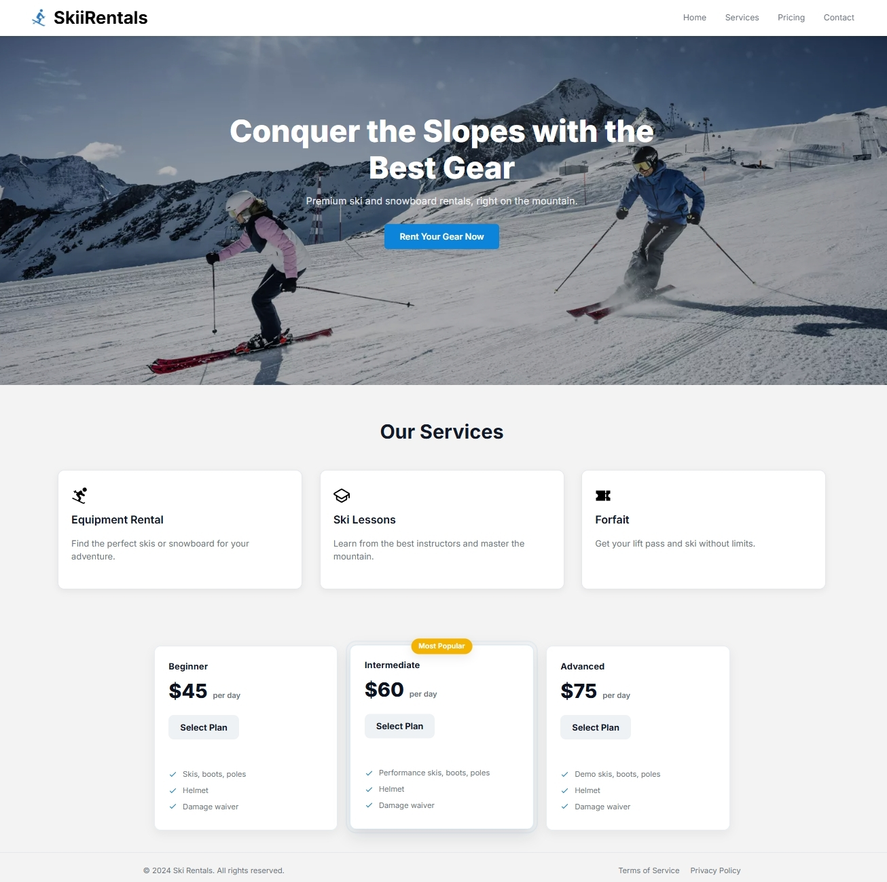

# 🎿 SkiiRentals – Landing Page Practice Project

## 🧭 Overview

This project is a **practice landing page** built entirely with **HTML5 and CSS3**, created to improve my front-end layout and design skills.  
It represents a fictional ski rental service called **SkiiRentals**, featuring a clean, modern, and minimalistic design inspired by real-world product landing pages.

The goal of this project was to **practice responsive design, Flexbox, CSS Grid, component structure, and visual hierarchy**, while maintaining a consistent color palette and typography.

---

## 🏗️ Project Structure

project/
│
├── index.html # Main structure of the page
├── styles.css # Global styles (variables, layout, and components)
├── img/ # Folder with icons, background and logo
└── screenshot.png # Project preview for GitHub

---

## 💡 Key Features

- **Fully responsive** layout using Flexbox and Grid.  
- **Hero section** with background image and call to action.  
- **Services section** with clean, shadowed cards and SVG icons.  
- **Pricing section** with three plans (Beginner, Intermediate, Advanced) and hover animations.  
- **Footer** with simple layout and subtle top border.  
- **Reusable variables** (`:root`) for colors, radius, and shadows.  
- **Accessible markup** and hover/focus effects for interactivity.

---

## 🎨 Design Choices

- **Typography:** [Inter](https://fonts.google.com/specimen/Inter) — clean and modern.  
- **Color palette:** soft greys, white backgrounds and a bright **blue accent** (`#0b84d9`) for key actions.  
- **Layout:** 3-column grid for pricing, flexible service cards, and a centered hero banner.  
- **Effects:** smooth transitions and drop shadows to add depth while keeping the minimalist style.

---

## 🧰 Technologies Used

- **HTML5** (semantic structure)
- **CSS3** (custom properties, flexbox, grid)
- **Google Fonts (Inter)**  
- **SVG icons** for lightweight visuals

---

## 🧠 What I Practiced

- Building layouts with **semantic HTML** and **clean BEM-like class names**.  
- Creating **reusable design components** (cards, buttons, containers).  
- Using **CSS variables** for scalable design consistency.  
- Improving **responsive design** for different screen sizes.  
- Refining **UI/UX basics** — spacing, color balance, typography hierarchy.  

---

## 🖼️ Preview

Below is an example of how the final page looks:

---

